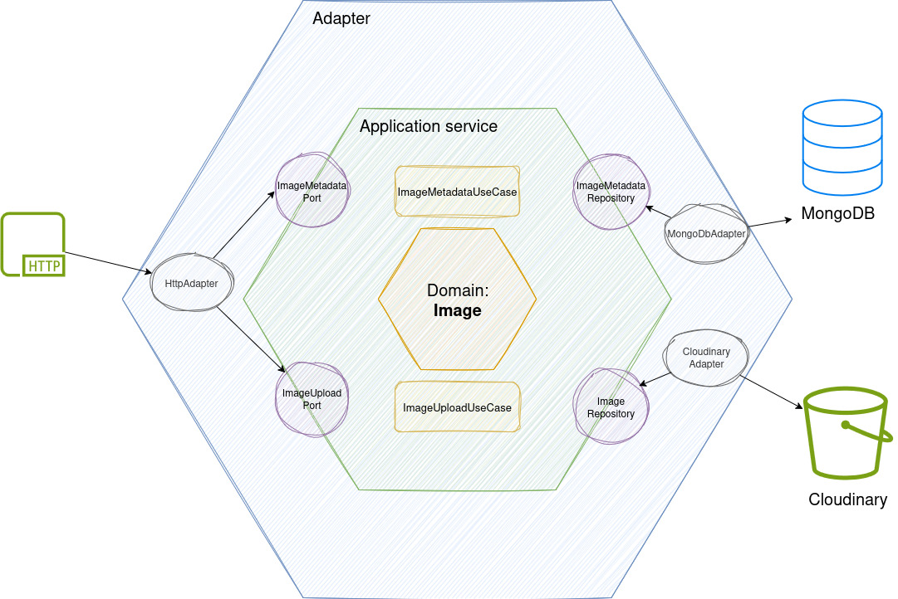

# Apply Hexagonal Architecture in NestJS

This project demonstrates how to implement **Hexagonal Architecture** (also known as **Ports and Adapters**) in a NestJS application for image processing and storage.

## 💡 Project Idea

This is a **server-side application** designed to handle image uploads and store them in cloud storage (Cloudinary/S3) for future editing capabilities. The project serves as the foundation for an image editing platform where users can:

- **Upload images** to the server
- **Store images** in cloud storage (Cloudinary)
- **Manage image metadata and versions** in MongoDB Atlas
- **Prepare for future editing features** (resize, filters, transformations)

### 🎯 Current Implementation Scope
This project focuses **only on the image management service** - the core functionality to:
- ✅ Accept image uploads via REST API
- ✅ Store images in Cloudinary cloud storage
- ✅ Save image metadata and version history in MongoDB
- ✅ Provide clean architecture for future extensions

### 🔮 Future Extensions (Not Implemented)
- Image editing operations (resize, crop, filters)
- Image transformations and processing
- User authentication and authorization
- Image sharing and collaboration features

We can apply microservice architecture for above extensions without changing the core business logic of image management.

### 📝 Diagram


## 📁 Project Structure

```
src/
├── domain/
│   ├── entities/                    # Domain entities
│   ├── use-cases/                   # Business logic (Application Layer)
│   │   ├── image-upload.use-case.ts
│   │   ├── image-metadata.use-case.ts
│   │   └── process-image.use-case.ts
│   └── ports/
│       ├── input/                   # Inbound ports (interfaces)
│       │   ├── image-upload.port.ts
│       │   └── image-metadata.port.ts
│       └── output/                  # Outbound ports (interfaces)
│           ├── image-storage.repository.ts
│           └── image-metadata-db.repository.ts
├── adapters/
│   ├── input/                       # Inbound adapters
│   │   └── restful-image-upload/
│   │       ├── restful-image-upload.controller.ts
│   │       └── restful-image-upload.module.ts
│   └── output/                      # Outbound adapters
│       ├── cloudinary/
│       │   ├── cloudinary.repository.ts
│       │   └── cloudinary.module.ts
│       └── mongodb/
│           ├── mongodb.repository.ts
│           ├── mongodb.module.ts
│           └── schemas/
└── infrastructure/                  # Dependency injection configuration
    └── infrastructure.module.ts
```

## 🔄 Hexagonal Architecture Components

### 1. **Domain Layer** (Core Business Logic)
- **Entities**: Core business objects
- **Use Cases**: Application business rules
- **Ports**: Interfaces for external communication

### 2. **Adapters Layer** (External World)
- **Inbound Adapters**: Controllers, CLI, etc.
- **Outbound Adapters**: Databases, APIs, File systems, etc.

### 3. **Infrastructure Layer** (Wiring)
- Dependency injection configuration
- Module registration and exports

## 🎯 Key Principles

### ✅ **Dependency Rule**
- **Dependencies point inward** toward the domain
- **Domain never depends on adapters**
- **Adapters depend on domain through ports**

### ✅ **Port Types**

#### **Inbound Ports** (Driving Side)
```typescript
export interface IImageUploadUseCase {
  execute(file: Express.Multer.File): Promise<string>;
}
```

#### **Outbound Ports** (Driven Side)
```typescript
export interface IImageStorage {
  upload(file: Express.Multer.File): Promise<{url: string; key: string}>;
  remove(key: string): Promise<{status: boolean}>;
}
```

## 🚀 Implementation Examples

### **Inbound Flow**: Controller → Use Case
```typescript
// Inbound Adapter (Controller)
@Controller('images')
export class RestfulImageUploadController {
  constructor(
    @Inject('IImageUploadUseCase')
    private imageUploadUseCase: IImageUploadUseCase,
  ) {}

  @Post('upload')
  async upload(@UploadedFile() file: Express.Multer.File) {
    return await this.imageUploadUseCase.execute(file);
  }
}

// Use Case (implements Inbound Port)
@Injectable()
export class ImageUploadUseCase implements IImageUploadUseCase {
  constructor(
    @Inject('IImageStorage')
    private imageStorage: IImageStorage,
  ) {}

  async execute(file: Express.Multer.File): Promise<string> {
    const result = await this.imageStorage.upload(file);
    return result.url;
  }
}
```

### **Outbound Flow**: Use Case → Repository
```typescript
// Outbound Adapter (Repository)
@Injectable()
export class CloudinaryStorageRepository implements IImageStorage {
  async upload(file: Express.Multer.File): Promise<{url: string; key: string}> {
    // Cloudinary implementation
    const result = await cloudinary.uploader.upload_stream(/* ... */);
    return { url: result.secure_url, key: result.public_id };
  }
}
```

## 🔧 Dependency Injection Setup

```typescript
// Infrastructure Module
@Module({
  imports: [CloudinaryModule, MongodbModule],
  providers: [
    // Outbound ports
    {
      provide: 'IImageStorage',
      useExisting: 'CloudinaryStorageRepository',
    },
    {
      provide: 'IImageMetadataDb',
      useExisting: 'MongodbRepository',
    },
    // Inbound ports
    {
      provide: 'IImageUploadUseCase',
      useClass: ImageUploadUseCase,
    },
  ],
  exports: ['IImageStorage', 'IImageMetadataDb', 'IImageUploadUseCase'],
})
export class InfrastructureModule {}
```

## 🔄 Swapping Implementations

Easy to switch from Cloudinary to AWS S3:

```typescript
// Just change the provider in InfrastructureModule
{
  provide: 'IImageStorage',
  useExisting: 'S3StorageRepository', // Instead of CloudinaryStorageRepository
}
```

## ✨ Benefits of This Architecture

1. **🧪 Testability**: Easy to unit test with mocks
2. **🔄 Flexibility**: Easy to swap implementations
3. **🎯 Single Responsibility**: Each component has one purpose
4. **🛡️ Independence**: Domain logic independent of frameworks
5. **📈 Scalability**: Easy to add new features and adapters

## 🚀 Getting Started
1. **Install dependencies**:
   ```bash
   npm install
   ```

2. **Set up environment variables**:
   ```bash
   touch .env
   # Create file .env and configure your Cloudinary and MongoDB credentials
   ```

3. **Run the application**:
   ```bash
   npm run start:dev
   ```

4. **Test the API**:
   - Visit `http://localhost:3000/api` for Swagger documentation
   - Upload images via POST `/images/upload`

## 🎓 Learning Outcomes

By studying this project, you'll learn:

- ✅ How to implement Hexagonal Architecture in NestJS
- ✅ Proper separation of concerns between layers
- ✅ Dependency injection patterns with interfaces
- ✅ How to easily swap external dependencies
- ✅ Best practices for modular architecture
